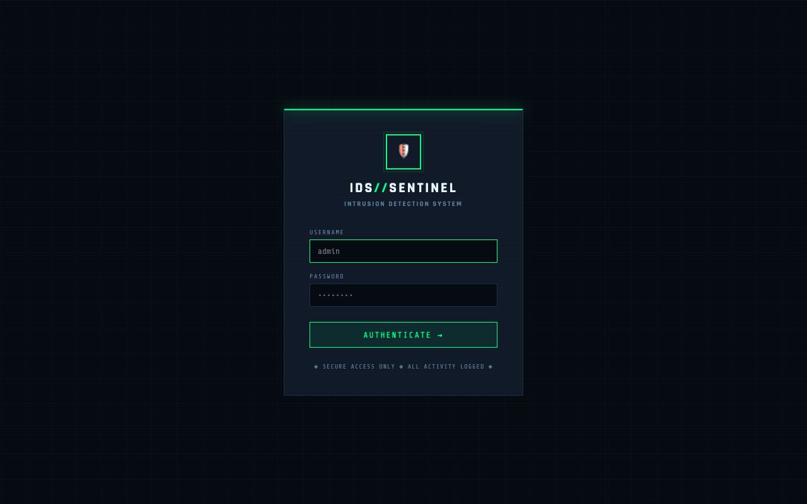

# IDS//SENTINEL — Distributed Intrusion Detection System

A distributed, web-based IDS built with Python (Scapy + Flask) featuring a dark terminal-style dashboard, real-time alert streaming, and a multi-node agent architecture.



---

## Features

- **Distributed Agent Architecture** — Deploy lightweight sniffing agents across multiple nodes that report back to a central dashboard.
- **SOC AI Assistant (RAG Engine)** — Integrated Gemini AI to analyze network alerts, correlate attack patterns, and provide actionable mitigation steps.
- **Port Scan Detection** — Detects horizontal/vertical port scanning in configurable time windows.
- **DDoS Pattern Detection** — Flags IPs exceeding packet-per-second thresholds.
- **SYN Flood Detection** — Catches TCP SYN floods (no ACK handshake completion).
- **ICMP Flood Detection** — Detects ICMP ping storms.
- **Abnormal Packet Detection** — Flags oversized packets (potential fragmentation/evasion attacks).
- **Real-time Dashboard** — Live SSE-powered feed, protocol breakdown, and top talkers.
- **Gmail Email Alerts** — Configurable SMTP alerts with cooldown deduplication.
- **Demo Mode** — Simulates realistic attack traffic (no root required for testing).

---

## Quick Start

### 1. Install dependencies

```bash
pip install -r requirements.txt
```

### 2. Start the Central Dashboard

The central dashboard securely receives telemetry and alerts from your distributed agents.

```bash
# Run the development server
python app.py

# OR run the production server via Gunicorn
./start_server.sh
```

Open your browser to: **http://localhost:8080**

**Default Login:**
- **Username:** `admin`
- **Password:** `admin123`

### 3. Register an Agent

1. Log into the dashboard.
2. Navigate to the **Agents** tab.
3. Click **Generate New Key** and copy the generated API Key.

### 4. Run the IDS Agent (On Target Machines)

The agent performs the actual packet capture and sends data back to the dashboard. Demo mode is ON by default, simulating network traffic and periodic attacks.

```bash
python agent.py --api-key "ak_your_generated_key" --server "http://localhost:8080"
```
*(If running the agent on a different machine, replace `localhost` with the IP address of the central dashboard).*

### 5. Run with Real Network Capture (Requires Root/Admin)

To capture live traffic instead of simulated demo traffic:
1. Edit `ids_engine.py` and set:
   ```python
   CONFIG = {
       "DEMO_MODE": False,
       "INTERFACE": "eth0",   # Change to your interface (use `ip link` or `ifconfig` to find it)
       # ...
   }
   ```
2. Run the agent as root:
   ```bash
   sudo python agent.py --api-key "ak_your_generated_key" --server "http://your_server_ip:8080"
   ```

---

## Gmail Email Alerts Setup

1. Enable 2-Factor Authentication on your Google account.
2. Go to: Google Account → Security → 2-Step Verification → App Passwords.
3. Create an App Password for "Mail" → copy the 16-char password.
4. Open the dashboard → click **⚙ CONFIG** → fill in:
   - Gmail Sender Address: `your_gmail@gmail.com`
   - Gmail App Password: `xxxx xxxx xxxx xxxx`
   - Alert Recipient Email: `analyst@yourcompany.com`
   - Toggle "Enable Gmail SMTP alerts" ON.
5. Click **SAVE CONFIGURATION**.

---

## SOC AI Assistant (Gemini) Setup

1. Generate a free API key from Google AI Studio.
2. Open the dashboard → click **⚙ CONFIG**.
3. Under the AI Assistant section, enter your `GEMINI_API_KEY`.
4. The dashboard will now provide AI-driven analysis for alerts and a chat interface for your SOC analysts.

---

## API Endpoints

| Method | Endpoint              | Description                                      |
|--------|-----------------------|--------------------------------------------------|
| GET    | /                     | Dashboard UI                                     |
| GET    | /api/alerts           | List alerts (query: severity, type)              |
| GET    | /api/stats            | System-wide statistics                           |
| GET    | /api/stream           | SSE real-time stream                             |
| POST   | /api/agent/sync       | Agent synchronization endpoint (Requires API Key)|
| POST   | /api/config           | Update global config                             |
| POST   | /api/rag/analyze      | AI analysis of a specific network alert          |
| POST   | /api/rag/chat         | AI chat assistant for SOC queries                |

---

## Project Structure

```
ids_project/
├── app.py              # Central Flask web server + REST API + Dashboard
├── agent.py            # Remote agent script for packet sniffing and reporting
├── ids_engine.py       # IDS engine (packet capture, detection) used by the agent
├── rag_engine.py       # SOC AI Assistant integration (Gemini API)
├── start_server.sh     # Gunicorn startup script for the production dashboard
├── requirements.txt    # Python dependencies
├── templates/
│   └── index.html      # Dark terminal dashboard UI
└── README.md
```

---

## Production Notes

- For production environments, always use `./start_server.sh` (Gunicorn) rather than the Flask development server.
- Scapy requires `libpcap` (`sudo apt install libpcap-dev` on Debian/Ubuntu).
- On Windows, install Npcap (https://npcap.com) instead of libpcap.
